# VEGAN
### KUNSTlig intelligens

Clone of [Zach Monge](https://github.com/zachmonge)'s [Forest GAN](https://github.com/zachmonge/cyclegan_forest_abstract_art_Duke_zm), cleaned up to accept updates in various Python packages and [PyTorch Cycle-GAN](https://github.com/junyanz/pytorch-CycleGAN-and-pix2pix)

### Abstract Corals

  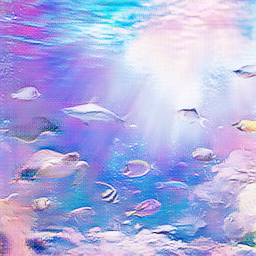
  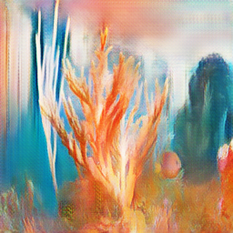 
  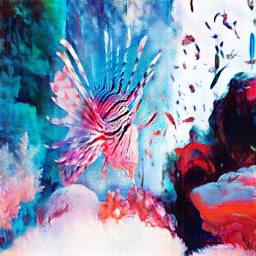
  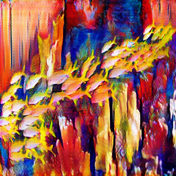
  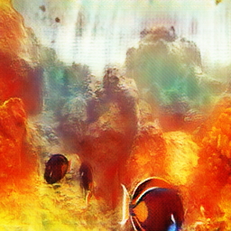
  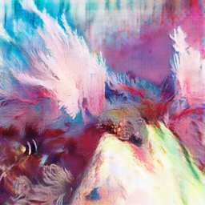 
  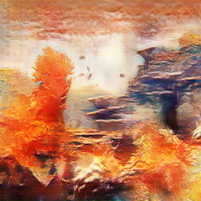
  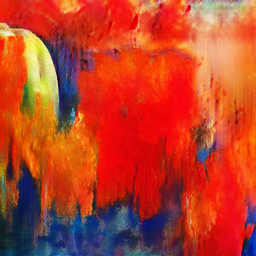
  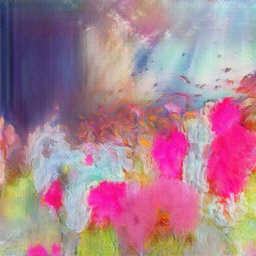
  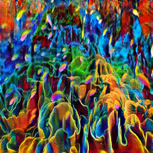 
  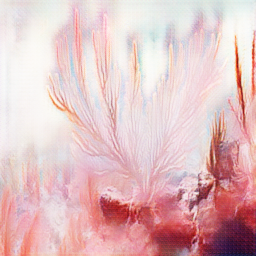
  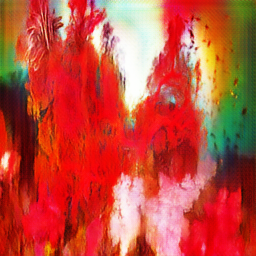

### Coming "soon"
* https://no.pinterest.com/pin/347973508707225607/ + landscapes
* cubism/polygon art
